# Send to Agent

Role: Product designer. Sentry AI/ML team, Summer 2026.

Sentry · Product design internship · 2026

### Send to Agent

[Homepage animation: response-level handoff with multiple agents]

Overview

### Helping developers continue an investigation outside Seer

Seer is Sentry’s AI debugging agent for developers and software engineers. It lives inside Sentry, alongside the production issues they are investigating. Developers ask questions in plain language. Seer reads issue details, traces, logs, and profiles to investigate, showing its progress along the way.

The investigation was only one part of the developer’s workflow. After using Seer to understand an issue, developers moved to tools like Cursor or Claude to write the fix. Transferring the findings meant manually copying context and rebuilding it in the next tool, interrupting that flow.

During my AI/ML rotation, I designed Send to Agent to connect those steps: carry a useful response or the full investigation into a coding agent so developers could keep working with the context they had already built.

## Developers were already moving context by hand

There were three workarounds: copy the session to the clipboard, copy a session link, or copy an individual block. Each moved something out of Seer, but none was designed around continuing the investigation in another agent.

A session link depended on authentication and a client-rendered page. The receiving agent could not reliably read it. A copied response had a different problem: it could leave behind the question and evidence that made the answer useful.

### Starting with two developer needs

I began by defining two user segments and mapping their goals in FigJam. A developer who had found a useful answer wanted to take that specific context into another tool. Someone who had reached a limit in Seer wanted to continue the whole investigation elsewhere. Designing only for one would make the other do unnecessary selection work.

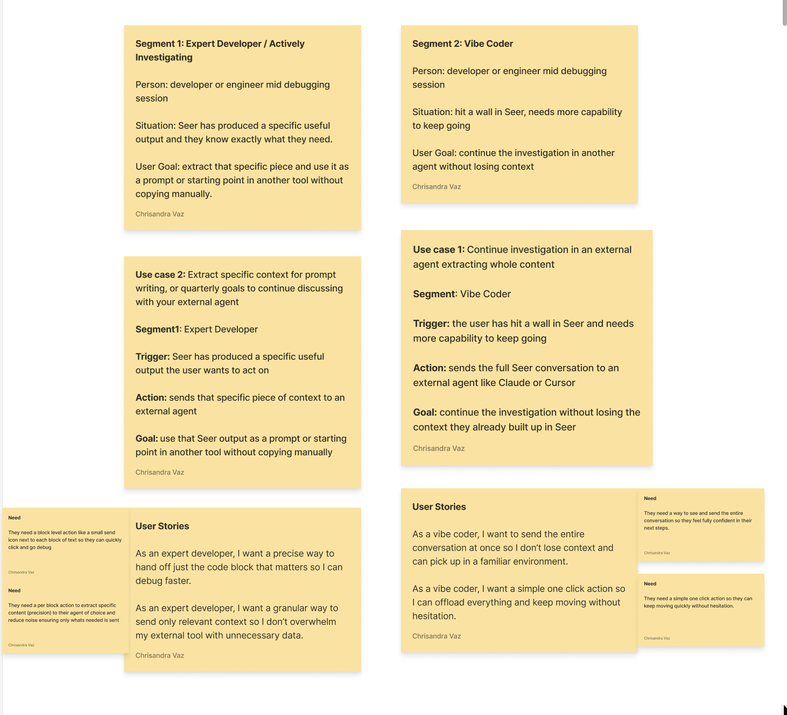

I mapped the two user segments to their goals before choosing an entry point.

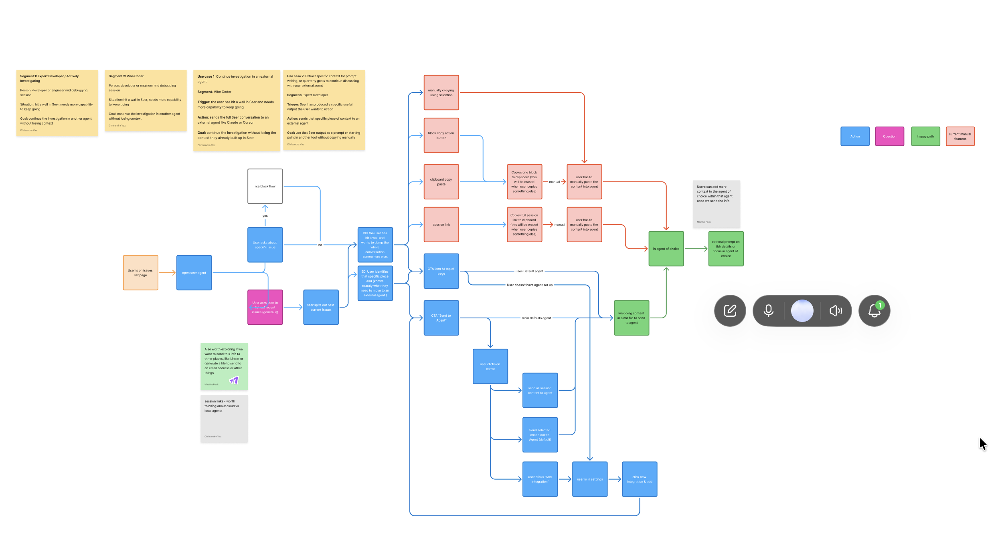

The working flow maps the manual copying paths alongside the proposed handoff and setup paths.

## Two ways to send context to a coding agent

Two entry points make the scope clear before sending. The response action carries one answer and its supporting context. The navigation action carries the whole conversation.

[Animated response handoff]

01 / From the chat

### Send a specific response

A developer has found a useful response and is ready to act on it. The action beside that response sends the answer, its related tool calls, and the last user message.

This example shows multiple configured agents: open the robot menu, choose Claude, then see confirmation in the chat.

Sends: response + tool calls + last user message

[Animated navigation handoff]

02 / From the navigation

### Send the full conversation

When the next step belongs in a coding agent, the top navigation sends the full conversation. Earlier questions, findings, and tool calls travel together.

This example shows one configured agent. Clicking the Claude icon starts the handoff directly; the caret keeps agent choices and integration setup accessible.

Sends: the full conversation

Both entry points support one or multiple configured agents. With multiple agents, a robot control opens the destination choices. With one agent, its icon identifies the destination and the primary click sends directly.

## Understanding what people were copying

I looked at Amplitude to understand how people were moving context out of Seer. In the 30-day window I reviewed in May, there were 306 session clipboard events and 235 session-link copies. Those actions showed transfer behavior, though they could not tell me the intent behind every copy.

Block copying had only launched on May 21, so its 45 events had a shorter exposure period. Later, it reached 114–336 events per week. I kept those periods separate rather than treating them as a direct comparison.

97% had one agent configured. Among users with an agent integration, the destination was usually already decided. That gave the primary action a clear job: use the configured destination without requiring another menu choice.

The data helped simplify the route. The technical constraint shaped what travelled: readable investigation content, rather than relying on a session link.

## What does the next agent need to understand this answer?

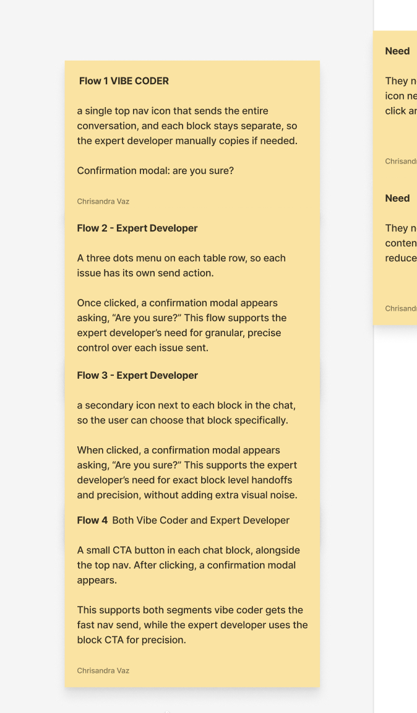

Early flow notes: I considered different levels of control, including confirmation steps that did not become part of the final flow.

This was the question behind the small button. A single reply was easy to send, but it could be incomplete on its own. Selecting a range gave more control, but also asked the developer to decide which earlier turns and tool outputs mattered.

I worked through these possibilities with an engineer, including on the whiteboard: which messages belonged in the payload, whether an optional prompt was needed, and how the destination would be chosen. That discussion helped separate the content decision from the control that triggered it.

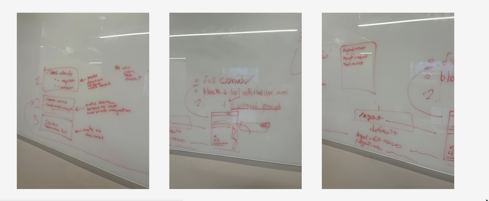

Working through the handoff with an engineer: what to send, how to choose the destination, and whether to request more context.

The early interactions approached that question differently. Highlighting text gave the developer control over the exact passage. A guided exchange could ask them to choose the scope and add a prompt before sending. I used these alternatives to work through how much preparation the handoff should require.

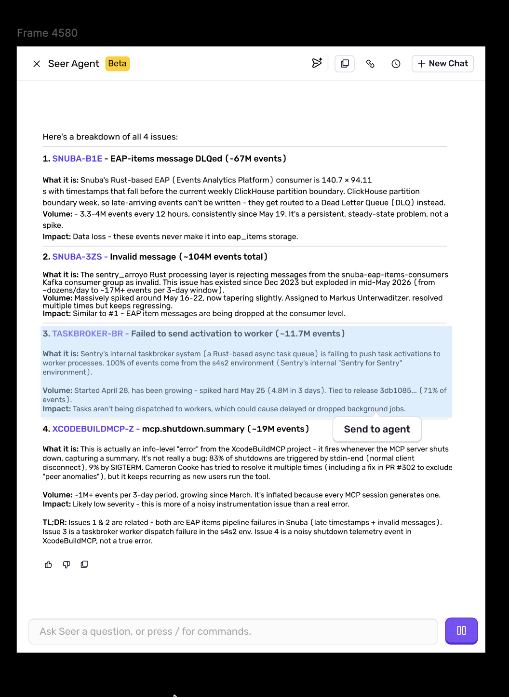

Exploration: highlighting a passage reveals an action beside the selected text.

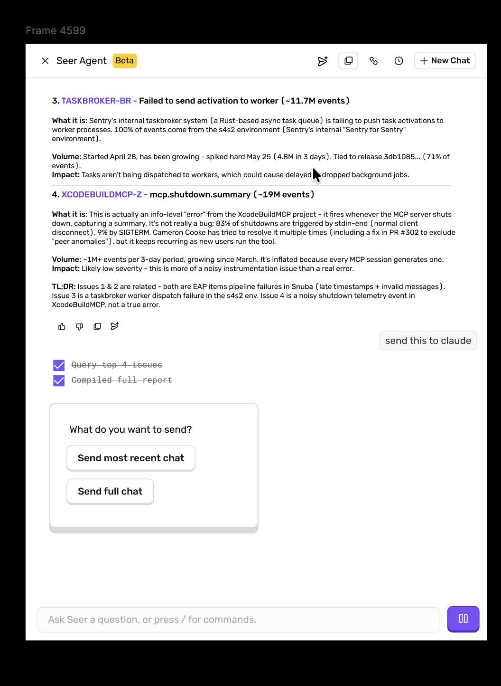

Exploration: asking the developer to choose the scope after initiating the handoff.

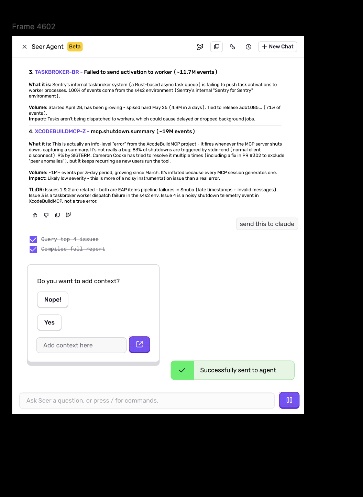

Exploration: an optional prompt before sending to the external agent.

### Making the scope predictable

I settled on two scopes with predictable boundaries. At response level, the package includes the last user message, the related tool calls, and Seer’s answer. At chat level, it includes the complete conversation. I annotated the payload in Figma so the implementation would carry more than the visible reply.

The final design establishes scope through the entry point itself. The developer can send directly, then continue or add context in the receiving agent. That made it especially important for the action’s placement to communicate what would travel before the click.

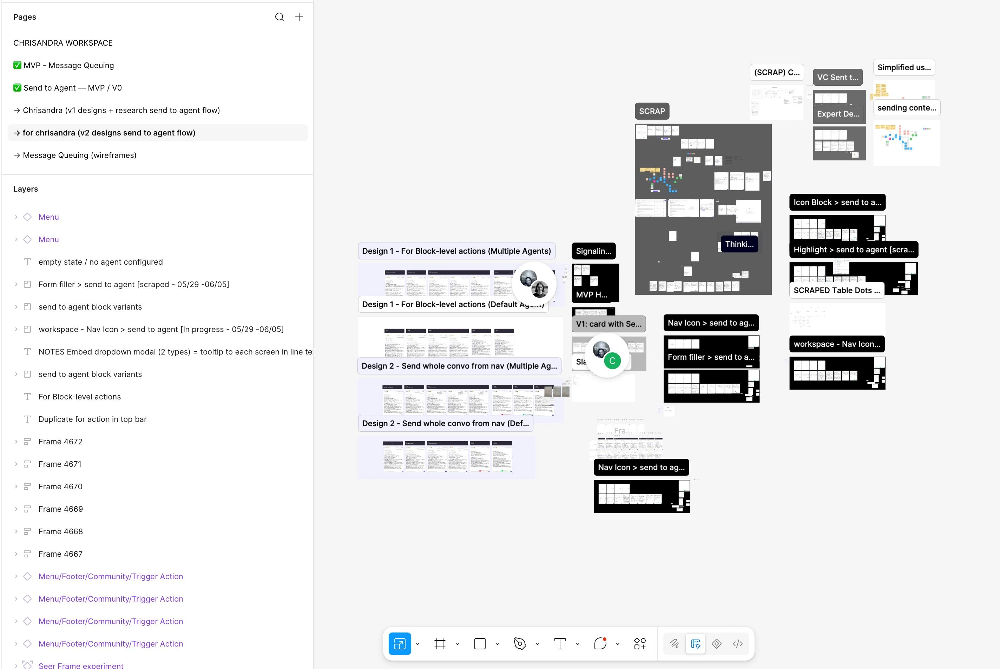

The working file includes response actions, navigation actions, selected-context explorations, and discarded directions.

## Finding a place for the action

I explored sending from a table’s three-dot menu, from a button beneath a response, and from the navigation using a forward-style icon with a small star. These were alternative ways to introduce the handoff, rather than features that all made it into the final design.

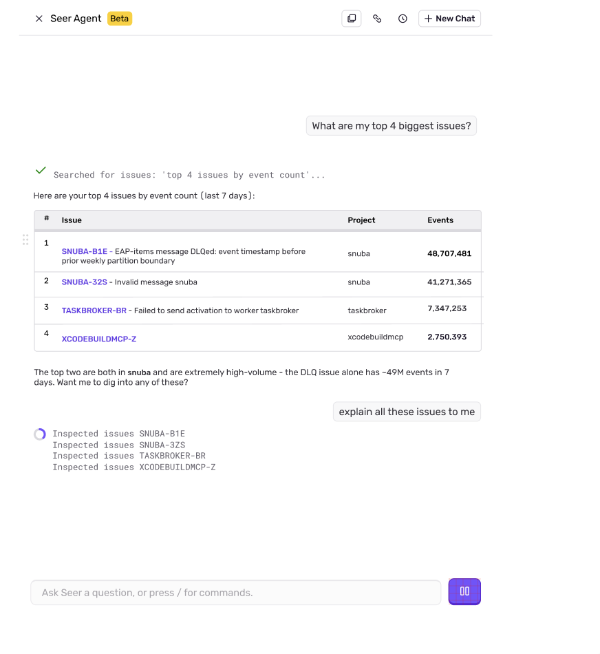

The table-output context for the proposed three-dot entry point. This screen shows the table, rather than an open action menu.

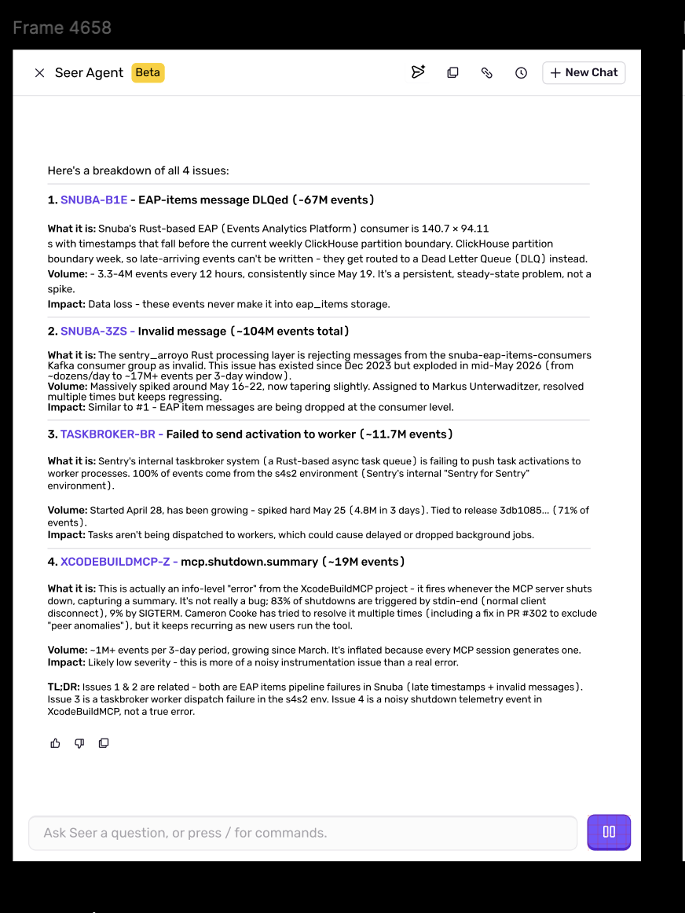

A navigation exploration using a forward-style icon with a small star.

### How much emphasis should sending have?

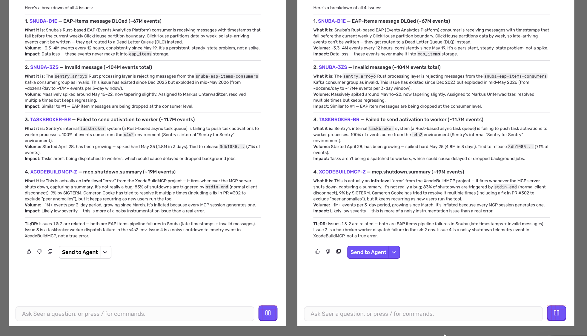

Comparing the emphasis of an outlined action and a filled purple action beneath the response.

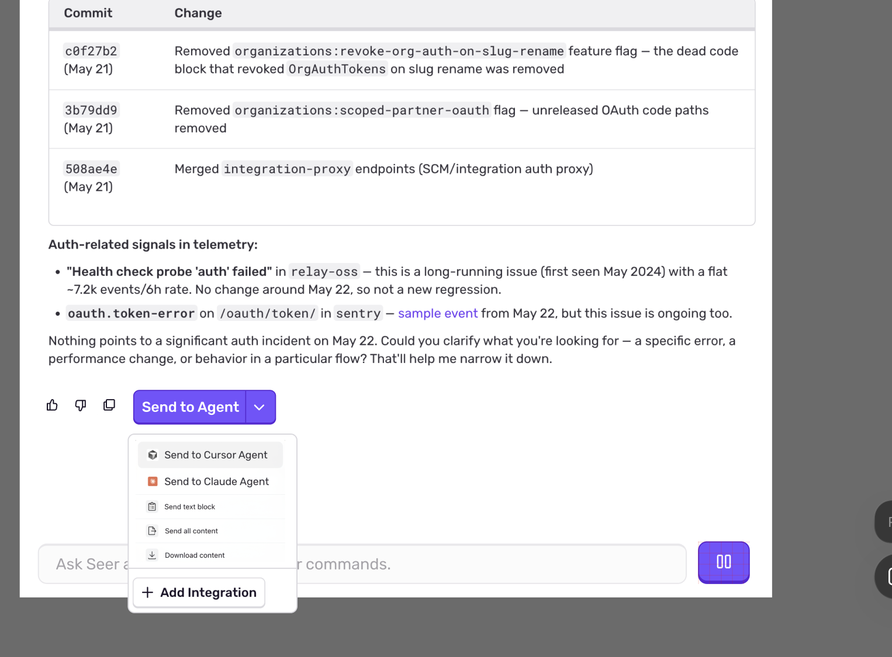

Exploration: destination, content scope, download, and setup options together in one menu. The later design gives scope to the entry point and keeps destination choices in the menu.

I explored a larger split button in the chat toolbar. In critique, its visual weight was too strong for a secondary action. I also explored slash commands for sending the full conversation or the most recent response. Seer already had a feedback pop-up, and we decided against adding another command-triggered pop-up for this handoff. The visible entry points let the action and its scope stay close to the content.

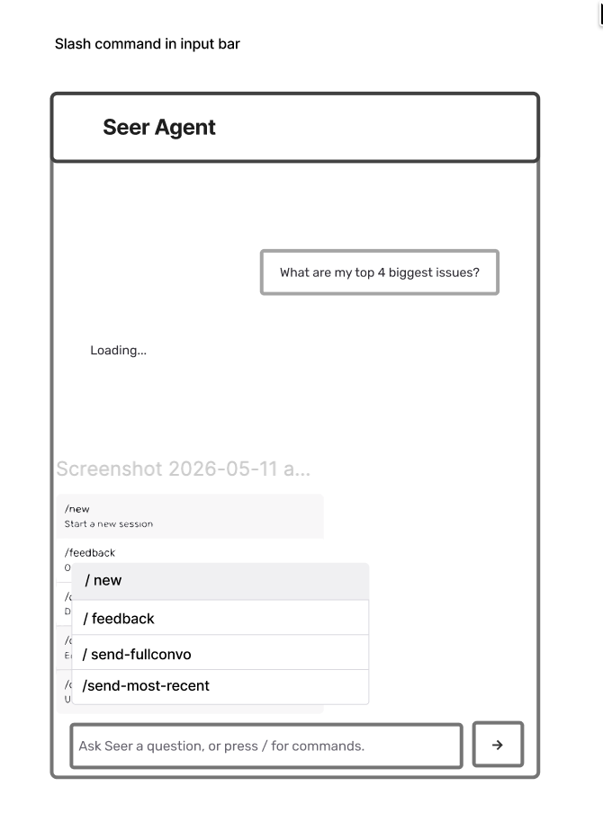

Exploration: expressing the two scopes as commands in the input.

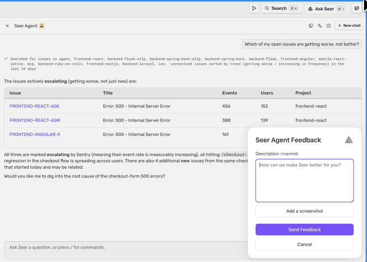

Existing product reference: the feedback pop-up informed the decision to avoid another form-based interruption.

I moved forward with a compact icon-based action, using the existing robot pattern for choosing among agents. Placing it beneath a response or in the navigation established what would be sent. This kept the two routes visible without asking the developer to work through the larger menu or a separate form.

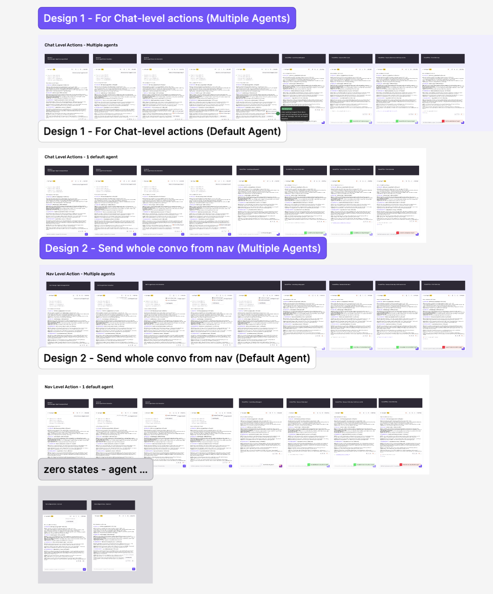

The full working board: both entry points across agent configurations, followed by the zero states.

## Designing the setup state

With no agent configured, opening the control shows “No Agents Configured” and an “Add Integration” action. This is a setup state: the developer has not attempted a transfer that failed.

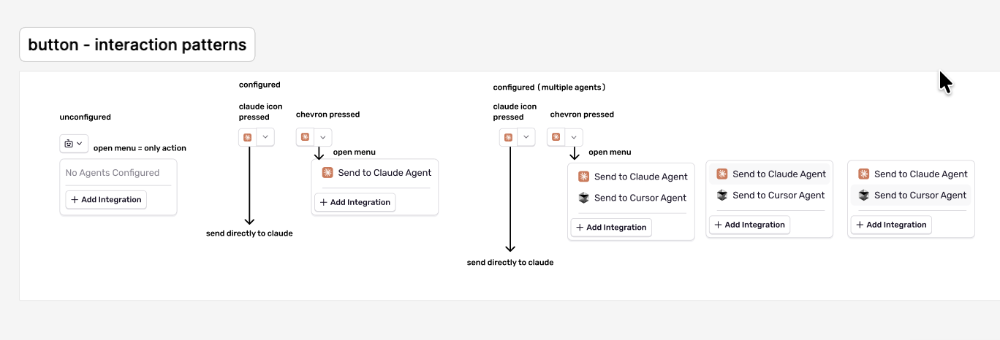

The unconfigured state sits alongside the configured states so the behavior is defined before, during, and after setup.

Integration setup may require an admin. I needed to provide a clear route to settings without making missing permissions look like a broken handoff. Once an agent is configured, the primary action can send directly; the caret still provides access to the menu.

## Showing what happened after sending

### Exploring a larger handoff block

I explored an expanded “Sent to Coding Agent” block that could show repository details, a link to the external agent, and running, success, or error states. I also considered what happened to the original conversation: one version changed the input to “Continue chatting with Seer,” while another showed a session-ended state. Those options raised questions about what the integration could actually tell us.

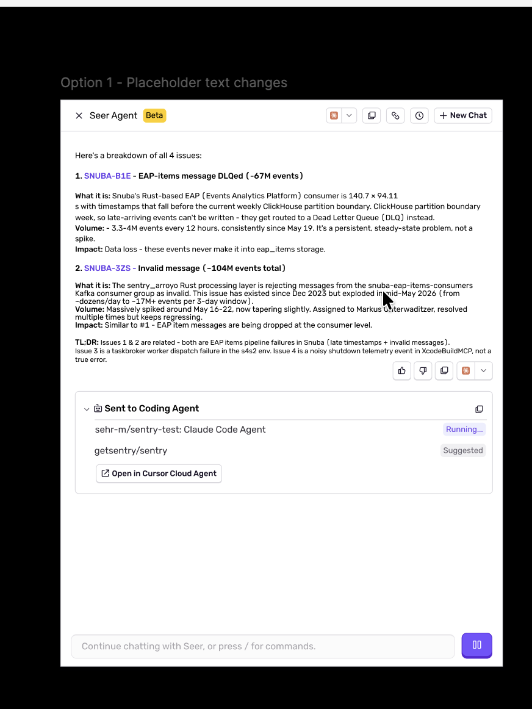

Exploration: an expanded handoff card, with a changed input placeholder inviting the developer to continue chatting.

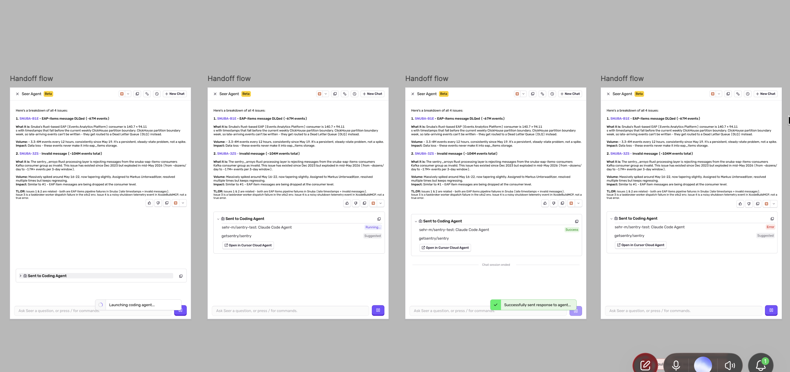

The larger card across its proposed states, including a version that ended the original chat session.

The receiving agent did not automatically return a completed fix to Seer. That limited what a success state could honestly say. It could confirm that the context had been handed off; it could not promise that the code had changed.

While the integration behavior was still being resolved, I explored both a one-way send and a flow that checked for updates. I worked with engineering and PM to clarify which status information the interface could support and pushed for a written decision when the answers differed.

### The final feedback stays in the chat

The final direction uses compact feedback: a launching indicator, a success message with a session link, or an error. The alert copy distinguishes a sent response from a sent conversation, so it confirms the scope of the action. The session link has its own hover treatment. These details make the handoff visible while keeping the investigation on screen.

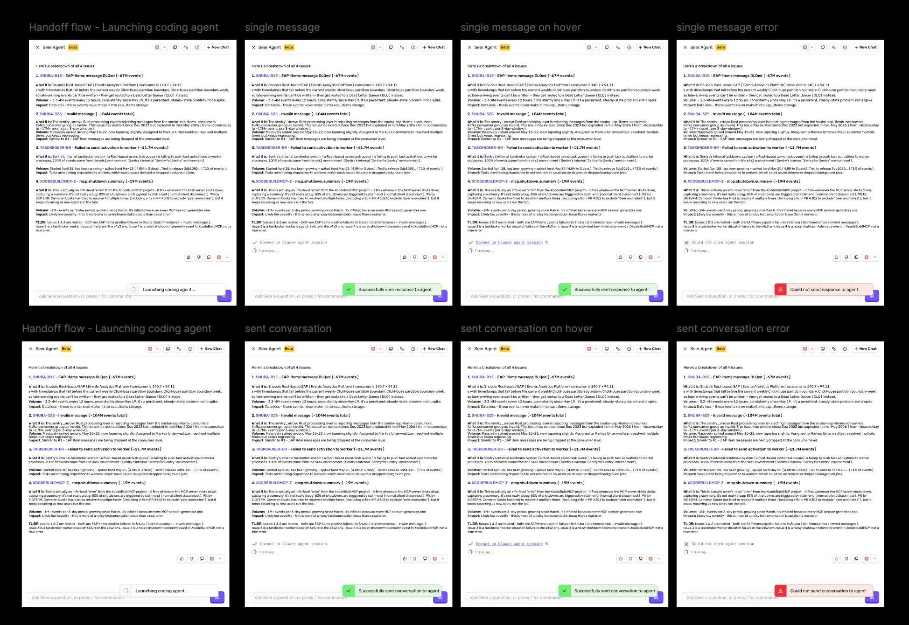

Final feedback: confirmation and the session link sit beneath the response, with the alert near the composer.

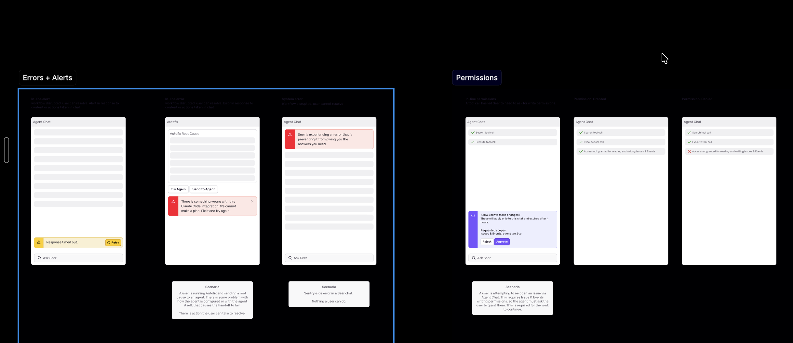

My state exploration distinguishes recoverable failures, system errors, and permission requests. These require different explanations and next steps.

## What the team approved

Design, engineering, and PM approved the design, and it entered the shipping cycle. The handoff covered response and conversation entry points, the content each sends, destination and setup behavior, and the states after sending.

Post-release results were not available for this case study. The next thing I would want to learn is whether developers can begin useful work in the receiving agent without having to rebuild the context.

## What I learned

### The content shaped the interaction

I initially explored several ways to trigger sending. The more useful question was what the receiving agent needed. Once the response package included its question and tool calls, the two entry points had a clear purpose.

### The common path needed fewer choices

The configured-agent data helped me simplify the common path while keeping alternatives accessible. It was a specific reason to make the primary click direct.

### Engineering discussions changed the design

Feedback copy depended on the integration’s real capabilities. The conflicting answers about repository details and status taught me to document those decisions earlier. That would have reduced the time spent developing two incompatible feedback models.
